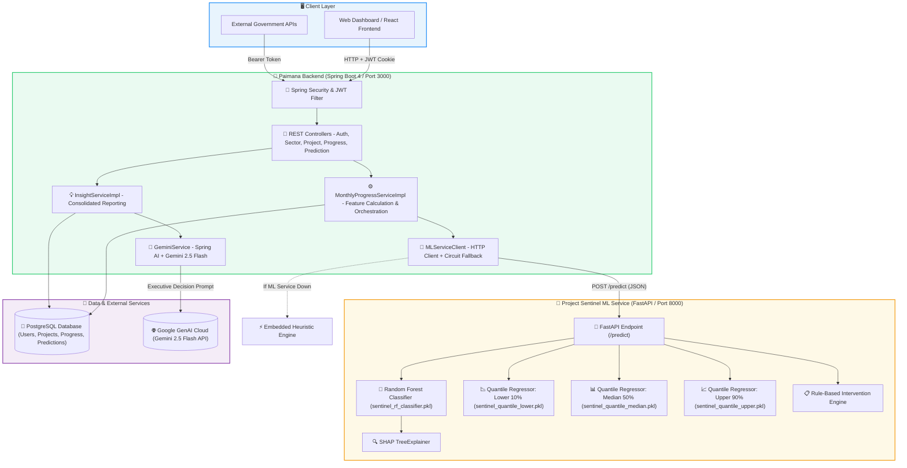
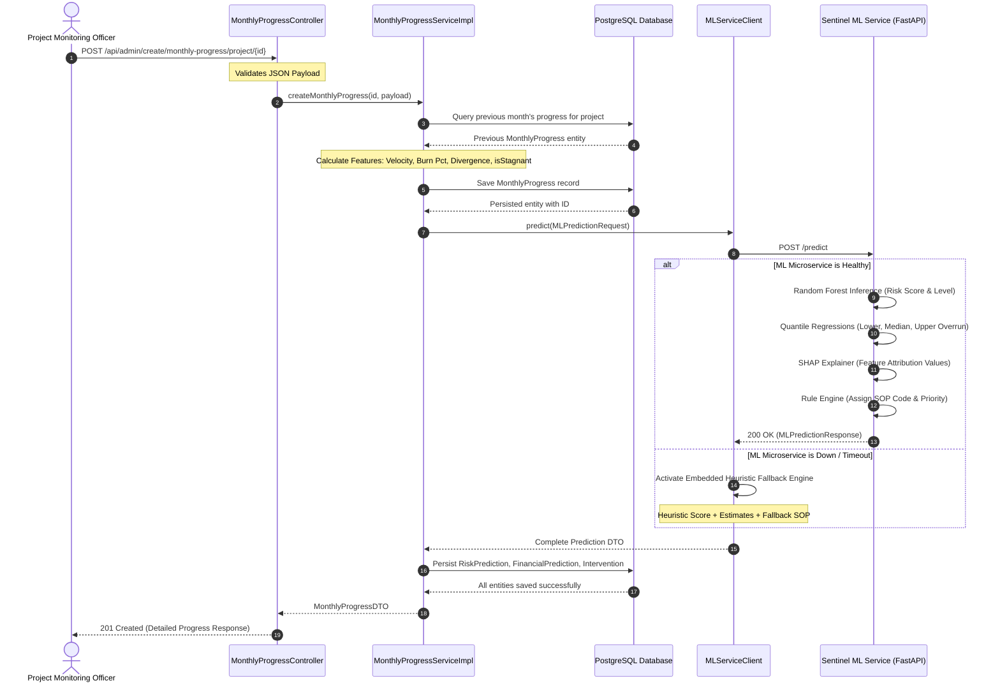
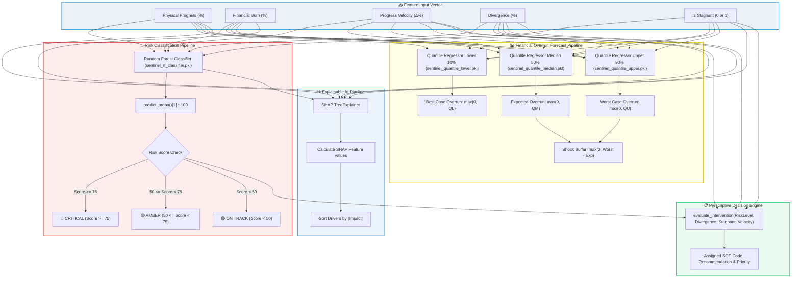
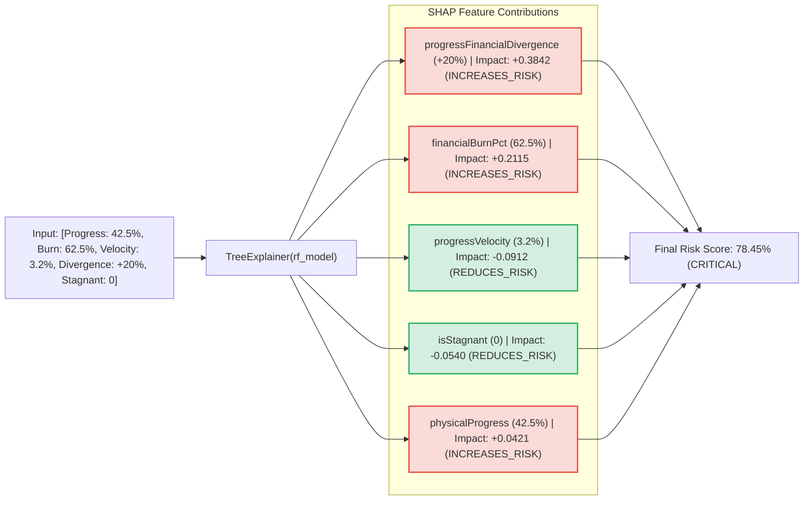
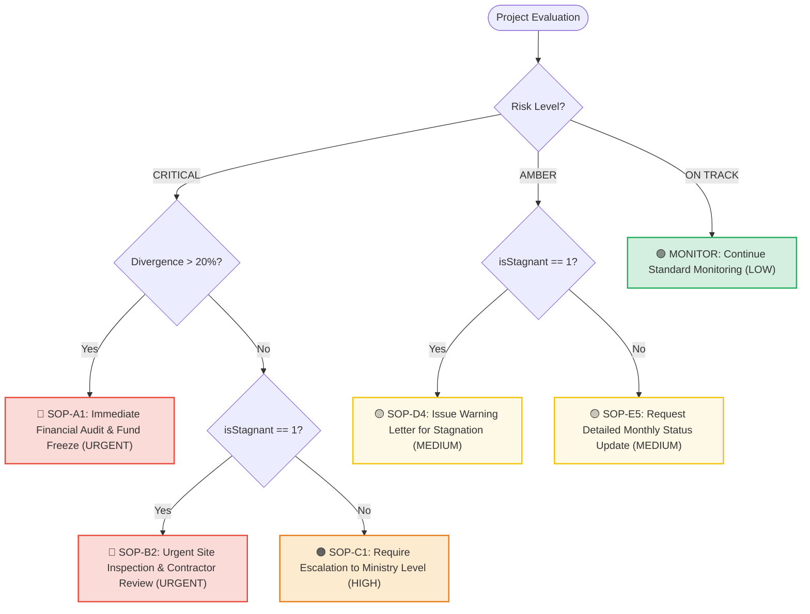
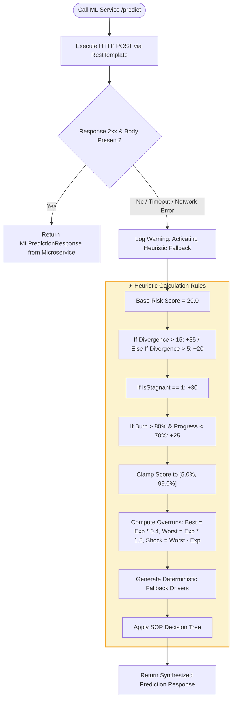
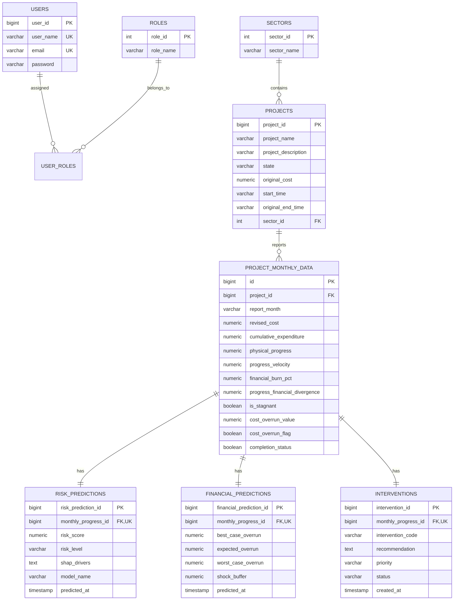

# 🚀 Paimana Backend & Project Sentinel ML Service

**Paimana** is an enterprise-grade, AI-driven project intelligence and decision-support platform designed to monitor large-scale infrastructure investments, detect financial and physical risks early, forecast cost overruns using machine learning, and prescribe automated standard operating procedures (SOPs).

---

### 🛠️ Technology Stack at a Glance

- **☕ Java 23**:  Modern backend runtime leveraging virtual threads, pattern matching, and enterprise scalability.
- **🍃 Spring Boot 4.1.1**:  Primary backend framework handling REST APIs, dependency injection, JPA transactions, and stateless JWT security.
- **⚡ FastAPI**:  High-throughput asynchronous Python microservice for real-time, low-latency machine learning inference.
- **🐍 Python 3.10+**:  Advanced machine learning ecosystem hosting Scikit-Learn, Joblib, NumPy, and Pandas.
- **🐘 PostgreSQL**:  Relational database persisting sectors, projects, monthly field metrics, predictions, and audit logs.
- **🤖 Google Gemini 2.5 Flash**:  Integrated via Spring AI to synthesize risk data, SHAP drivers, and SOPs into executive decision briefs.
- **🔍 SHAP (Explainable AI)**:  TreeExplainer engine calculating exact mathematical feature contributions and directional impacts for every prediction.

---

### 🎯 Core Capabilities at a Glance

- **🏛️ Sector & Project Hierarchy**: Multi-sector domain grouping, contract baseline tracking (`originalCost`, `startTime`, `originalEndTime`), and complete CRUD lifecycle management.
- **📈 Monthly Progress Ingestion & Feature Engineering**: Automated real-time derivation of Velocity, Financial Burn %, Divergence, Stagnation, and Budget Overrun flags.
- **🌲 Project Sentinel ML Inference Engine**: Dual-pipeline inference utilizing a Random Forest classifier (`sentinel_rf_classifier.pkl`) and 3x Quantile Regressors for overrun distributions.
- **🔍 Explainable AI (XAI) with SHAP**: `shap.TreeExplainer` feature attribution calculating exact impact magnitude and direction (`INCREASES_RISK` vs `REDUCES_RISK`).
- **📋 Prescriptive SOP Interventions**: Automated institutional action plans (`SOP-A1`, `SOP-B2`, `SOP-C1`, `SOP-D4`, `SOP-E5`, `MONITOR`) based on operational distress triggers.
- **🤖 Generative AI Decision Briefs**: Google Gemini 2.5 Flash integration via Spring AI delivering zero-hallucination ministerial briefs.
- **🔐 Enterprise Security & RBAC**: Stateless JWT authentication, HttpOnly cookies, BCrypt hashing, and dual-role separation (`ROLE_USER`, `ROLE_ADMIN`).
- **⚡ Fault-Tolerant Heuristic Fallback**: Embedded Java heuristic engine guaranteeing 100% uptime if the Python ML microservice is offline.
- **🔄 End-to-End Prediction Lifecycle**: Fully automated 8-step pipeline from progress submission to executive decision briefing.

---

## 📑 Table of Contents

- **[🛠️ Technology Stack at a Glance](#️-technology-stack-at-a-glance)**: Point-wise summary of Java 23, Spring Boot 4, FastAPI, Python, PostgreSQL, Gemini 2.5 Flash, and SHAP.
- **[🎯 Core Capabilities at a Glance](#-core-capabilities-at-a-glance)**: High-level overview of the 8 foundational platform pillars.
- **[🌟 Executive Summary](#-executive-summary)**: Problem statement, institutional challenges, and Paimana's predictive paradigm.
- **[🏛️ System Architecture](#️-system-architecture)**: Visual architecture flowchart connecting Client, Spring Boot Backend, ML Microservice, and Database layers.
- **[⚡ Core Features](#-core-features)**: In-depth technical breakdown of all 8 core platform modules:
  - **[1. Sector & Project Hierarchy](#1-sector--project-hierarchy)**: Domain categorization, contract baselines, and CRUD operations.
  - **[2. Monthly Progress Ingestion & Feature Engineering](#2-monthly-progress-ingestion--feature-engineering)**: Field data capture and automated mathematical feature derivation.
  - **[3. Project Sentinel ML Inference Engine](#3-project-sentinel-ml-inference-engine)**: Random Forest risk classification and Quantile Regression overrun forecasts.
  - **[4. Explainable AI (XAI) with SHAP](#4-explainable-ai-xai-with-shap)**: Mathematical feature importance attribution and directional impact analysis.
  - **[5. Prescriptive SOP Interventions](#5-prescriptive-sop-interventions)**: Rule-based translation of predictions into actionable institutional procedures.
  - **[6. Generative AI Decision Briefs (Google Gemini 2.5 Flash)](#6-generative-ai-decision-briefs-google-gemini-25-flash)**: Zero-hallucination executive briefs for ministers and boards.
  - **[7. Enterprise Security & Role-Based Access Control](#7-enterprise-security--role-based-access-control)**: Stateless JWT authentication, RBAC, and security hardening.
  - **[8. Fault-Tolerant Heuristic Fallback Engine](#8-fault-tolerant-heuristic-fallback-engine)**: Embedded Java fallback ensuring 100% platform availability.
- **[🧠 Machine Learning Model Flow & Architecture](#-machine-learning-model-flow--architecture)**: End-to-end ML lifecycle, formulas, and visual diagrams:
  - **[End-to-End Prediction Lifecycle (Point-Wise Breakdown)](#end-to-end-prediction-lifecycle-point-wise-breakdown)**: Step-by-step 8-stage operational flow.
  - **[End-to-End Sequence Diagram](#end-to-end-sequence-diagram)**: Visual sequence flow between actors, services, and databases.
  - **[Mathematical Feature Formulation](#mathematical-feature-formulation)**: Exact mathematical equations for all calculated metrics.
  - **[Multi-Model Inference Pipeline](#multi-model-inference-pipeline)**: Multi-branch ML execution pipeline graph.
  - **[SHAP Feature Attribution Engine](#shap-feature-attribution-engine)**: Visual explanation of risk-increasing vs risk-reducing features.
  - **[Prescriptive Intervention Decision Tree](#prescriptive-intervention-decision-tree)**: Decision logic mapping risk levels to SOP codes.
  - **[Heuristic Fallback Strategy](#heuristic-fallback-strategy)**: Fallback logic and heuristic score calculation rules.
- **[🗄️ Database Schema & Relationships](#️-database-schema--relationships)**: Relational ER diagram mapping all PostgreSQL entities.
- **[🔌 REST API Reference](#-rest-api-reference)**: Comprehensive endpoint catalog with HTTP methods and authorization rules:
  - **[Authentication Endpoints](#authentication-endpoints)**: Signup, login, logout, and user profile routes.
  - **[Sector Management Endpoints](#sector-management-endpoints)**: CRUD operations for infrastructure sectors.
  - **[Project Management Endpoints](#project-management-endpoints)**: Project creation, updates, and sector-filtered views.
  - **[Monthly Progress Endpoints](#monthly-progress-endpoints)**: Progress ingestion and historical timeline queries.
  - **[Prediction & Insight Endpoints](#prediction--insight-endpoints)**: Endpoints for consolidated insights, risk scores, and SOPs.
  - **[ML Service Direct Endpoints](#ml-service-direct-endpoints)**: Direct FastAPI endpoints for inference and health checks.
- **[📦 Sample Request & Response Payloads](#-sample-request--response-payloads)**: Real-world JSON examples for progress ingestion and consolidated insights.
- **[⚙️ Environment Configuration](#️-environment-configuration)**: Reference table of all environment variables and configuration settings.
- **[🛠️ Installation & Setup Guide](#️-installation--setup-guide)**: Step-by-step instructions to run PostgreSQL, FastAPI, and Spring Boot locally:
  - **[Prerequisites](#prerequisites)**: Required runtimes and system dependencies.
  - **[Step 1: Environment Setup](#step-1-environment-setup)**: Cloning the repository and configuring environment variables.
  - **[Step 2: Database Initialization](#step-2-database-initialization)**: Creating and verifying the PostgreSQL database.
  - **[Step 3: Launch Project Sentinel ML Service](#step-3-launch-project-sentinel-ml-service)**: Setting up virtualenv, installing requirements, and running Uvicorn.
  - **[Step 4: Launch Spring Boot Backend](#step-4-launch-spring-boot-backend)**: Launching the Spring Boot application using Maven Wrapper.

---

## 🌟 Executive Summary

Public infrastructure and high-capital private construction projects suffer from systemic cost overruns, timeline slippages, and project stagnation. Traditional monitoring dashboards rely on lagging indicators that report budget exhaustion only after capital has already been misallocated.

> [!IMPORTANT]
> **Paimana changes the paradigm from passive reporting to active decision intelligence.**
> By continuously calculating physical-financial divergence and feeding high-order velocity metrics into an ensemble of Random Forest and Quantile Regression models, Paimana alerts decision-makers months before overruns crystallize.

### Platform Highlights

- **Dual-Stack Architecture**: Java 23 / Spring Boot 4 for enterprise reliability and FastAPI / Python 3.10+ for machine learning inference.
- **Explainable Predictions**: Powered by SHAP (TreeExplainer) to provide transparent reasons for every risk score.
- **Actionable Interventions**: Built-in rule-based decision trees mapped directly to Standard Operating Procedures (SOPs).
- **Executive AI Briefing**: Google Gemini 2.5 Flash integration through Spring AI to generate human-readable ministerial summaries.
- **Zero-Downtime Fallback**: Built-in heuristic fallback engine ensuring uninterrupted service even during ML service maintenance.

---

## 🏛️ System Architecture

The following diagram illustrates how the components of Paimana interact across the presentation, application, machine learning, and persistence layers:



---

## ⚡ Core Features

### 1. Sector & Project Hierarchy
- **Domain Categorization**: Groups infrastructure initiatives into sectors (e.g., *Transportation, Healthcare, Water Resources, Energy, Urban Infrastructure*).
- **Baseline Contract Tracking**: Records immutable contract terms:
  - `originalCost`: Baseline financial allocation.
  - `startTime` & `originalEndTime`: Contractual project duration.
  - `state`: Geographic location and jurisdiction.
  - `projectDescription`: Scope and deliverables.
- **Relational Integrity**: Projects maintain a Many-to-One relationship with sectors and a One-to-Many cascade with monthly progress records.
- **CRUD Operations**: Comprehensive REST endpoints supporting pagination, search, and dynamic sorting by project name, sector, or budget.

### 2. Monthly Progress Ingestion & Feature Engineering
- **User-Submitted Inputs**: Captures 4 simple monthly reporting metrics from the field:
  - `monthName`: Reporting cycle identifier (e.g., `2026-03`).
  - `revisedCost`: Current approved project budget.
  - `cumulativeExpenditure`: Total capital disbursed to date.
  - `physicalProgress`: Verified on-site completion percentage (0 - 100%).
- **Automated Feature Engineering Engine**: Automatically pulls the previous month's progress for that project and calculates 5 derivative operational signals:
  - **Progress Velocity ($v_t$)**: Rate of physical progress change ($\Delta \text{Physical Progress} = \text{Current} - \text{Previous}$).
  - **Financial Burn Percentage ($B_t$)**: Proportion of revised budget expended ($(\text{Expenditure} / \text{Revised Cost}) \times 100$).
  - **Progress-Financial Divergence ($D_t$)**: The gap between capital burned and physical progress achieved ($B_t - \text{Physical Progress}$).
  - **Stagnation Flag ($S_t$)**: Automated binary detection ($1$ if $v_t \le 0$, else $0$) identifying stalled worksites.
  - **Cost Overrun Flags & Value**: Quantifies real-time budget creep beyond original baselines ($\text{Revised Cost} - \text{Original Cost}$).
- **Completion Detection**: Automatically flags projects reaching or exceeding 100% physical completion.

### 3. Project Sentinel ML Inference Engine
- **Random Forest Risk Classifier (`sentinel_rf_classifier.pkl`)**:
  - Predicts probability of project distress ($0.0 - 100.0\%$).
  - Categorizes projects into 3 operational risk tiers:
    - 🟢 **ON TRACK** (`riskScore < 50%`): Project proceeding within acceptable variance.
    - 🟡 **AMBER** (`50% <= riskScore < 75%`): Early signs of divergence or slowdown; needs monitoring.
    - 🔴 **CRITICAL** (`riskScore >= 75%`): Severe distress, stagnation, or expenditure mismatch requiring immediate intervention.
- **Quantile Regression Overrun Forecasts**:
  - **Lower Bound (`sentinel_quantile_lower.pkl`)**: Best-case financial overrun ($10^{\text{th}}$ percentile).
  - **Median Bound (`sentinel_quantile_median.pkl`)**: Expected financial overrun ($50^{\text{th}}$ percentile).
  - **Upper Bound (`sentinel_quantile_upper.pkl`)**: Worst-case financial overrun ($90^{\text{th}}$ percentile).
- **Shock Buffer Calculation**:
  - Computes the contingency reserve needed to absorb catastrophic tail risk: $\max(0, \, \text{Worst Case} - \text{Expected})$.

### 4. Explainable AI (XAI) with SHAP
- **Algorithmic Transparency**: Leverages `shap.TreeExplainer` on the Random Forest ensemble to decompose predictions into feature-level Shapley contributions.
- **Directional Impact**: Every feature is classified by its operational effect:
  - `INCREASES_RISK`: The feature drove the risk score higher (e.g., high divergence or stagnation).
  - `REDUCES_RISK`: The feature helped lower the risk score (e.g., healthy velocity or low burn rate).
- **Ranked Drivers**: Drivers are sorted by absolute magnitude so project officers instantly see the primary root causes of distress.

### 5. Prescriptive SOP Interventions
- **Institutional Alignment**: Directly translates statistical predictions into actionable Standard Operating Procedures (SOPs).
- **Automated SOP Catalog**:
  - **SOP-A1 (URGENT)**: *Immediate Financial Audit & Fund Freeze* (Triggered when Risk is CRITICAL and Divergence > 20%).
  - **SOP-B2 (URGENT)**: *Urgent Site Inspection & Contractor Review* (Triggered when Risk is CRITICAL and Project is Stagnant).
  - **SOP-C1 (HIGH)**: *Require Escalation to Ministry Level* (Triggered for general CRITICAL projects).
  - **SOP-D4 (MEDIUM)**: *Issue Warning Letter for Stagnation* (Triggered when Risk is AMBER and Project is Stagnant).
  - **SOP-E5 (MEDIUM)**: *Request Detailed Monthly Status Update* (Triggered for general AMBER projects).
  - **MONITOR (LOW)**: *Continue Standard Monitoring* (Assigned to all ON TRACK projects).
- **Tracking**: Interventions are saved with a `PENDING` status and timestamp for audit and operational follow-up.

### 6. Generative AI Decision Briefs (Google Gemini 2.5 Flash)
- **Executive Synthesis**: Uses **Spring AI** to prompt Google Gemini 2.5 Flash with structured project metrics, ML risk scores, SHAP drivers, and assigned SOPs.
- **Zero-Hallucination Prompt Contract**: The model is bound by strict constraints:
  - Cannot invent facts or modify ML risk scores.
  - Cannot alter risk classifications or SOP recommendations.
  - Must produce a concise, 6-section brief suitable for ministerial dashboards:
    1. Executive Summary
    2. Current Risk
    3. Main Risk Drivers
    4. Financial Exposure
    5. Recommended Action
    6. Immediate Next Step

### 7. Enterprise Security & Role-Based Access Control
- **Stateless JWT Security**: Issues signed JSON Web Tokens stored in secure HttpOnly cookies or passed via Bearer headers.
- **Role Separation**:
  - `ROLE_USER`: Read-only access to view sectors, projects, progress histories, and predictions.
  - `ROLE_ADMIN`: Administrative privileges to create sectors, add projects, ingest monthly progress, update records, and delete users.
- **Security Hardening**:
  - BCrypt password encryption.
  - Cross-Origin Resource Sharing (CORS) configured with allowed origins.
  - Automated seeding of default accounts (`admin` and `user1`) via `CommandLineRunner`.

### 8. Fault-Tolerant Heuristic Fallback Engine
- **Circuit Protection**: `MLServiceClient` uses a 4-second connection timeout and 6-second read timeout.
- **Intelligent Heuristic Execution**: If the Python service is offline or errors out, the Java backend automatically:
  - Calculates a baseline risk score adjusted by divergence, stagnation, and burn rates.
  - Computes expected, best-case, and worst-case overruns using heuristic budget multipliers.
  - Synthesizes fallback SHAP drivers and applies the SOP decision tree.
  - Persists all results to PostgreSQL, ensuring client requests succeed without interruption.

---

## 🧠 Machine Learning Model Flow & Architecture

### End-to-End Prediction Lifecycle (Point-Wise Breakdown)

The complete end-to-end flow from progress submission to executive decision brief proceeds in 8 point-wise steps:

1. **Step 1: Ingestion & Field Data Capture**
   - The monitoring officer submits a `POST` request to `/api/admin/create/monthly-progress/project/{projectId}` with revised cost, expenditure, physical progress, and month name.
   - Jakarta Validation verifies numeric bounds and required fields.

2. **Step 2: Historical Fetch & Delta Comparison**
   - The service queries PostgreSQL for the project's most recent prior monthly progress record.
   - Project contract baselines (`originalCost`) are retrieved for comparison.

3. **Step 3: High-Order Feature Engineering**
   - The backend computes Progress Velocity ($v_t$), Financial Burn % ($B_t$), Progress-Financial Divergence ($D_t$), Stagnation ($S_t$), and Overrun Value.
   - All engineered metrics are attached to the `MonthlyProgress` entity.

4. **Step 4: Persistence of Monthly Progress Record**
   - The `MonthlyProgress` record is saved to the `project_monthly_data` table, establishing its unique database ID.

5. **Step 5: Microservice Dispatch & HTTP Circuit Handling**
   - `MLServiceClient` packages the 5 features into an `MLPredictionRequest` and invokes `POST http://localhost:8000/predict`.
   - If the request succeeds within timeout limits, the Python microservice response is used.
   - If the microservice is unreachable, the embedded heuristic fallback engine executes transparently.

6. **Step 6: Multi-Model Machine Learning Inference**
   - **Risk Score**: `sentinel_rf_classifier.pkl` predicts overrun probability ($0 - 100\%$) and maps to `ON TRACK`, `AMBER`, or `CRITICAL`.
   - **Quantile Regressions**: Lower, Median, and Upper quantile regressors forecast overrun bounds and shock buffer.

7. **Step 7: SHAP Feature Attribution & SOP Evaluation**
   - `shap.TreeExplainer` generates feature importance values and classifies each feature as `INCREASES_RISK` or `REDUCES_RISK`.
   - The rule engine evaluates risk level, divergence, and stagnation to assign an institutional SOP code and priority.

8. **Step 8: Prediction Persistence & Executive LLM Briefing**
   - The backend saves `RiskPrediction`, `FinancialPrediction`, and `Intervention` entities linked to the monthly progress record.
   - When requested, `GeminiService` synthesizes all data points into a markdown executive brief using Google Gemini 2.5 Flash.

---

### End-to-End Sequence Diagram



---

### Mathematical Feature Formulation

The feature engineering layer computes the 5 input features required by the Project Sentinel models:

```
1. Progress Velocity:
   v(t) = PhysicalProgress(t) - PhysicalProgress(t - 1)

2. Financial Burn Percentage:
   B(t) = (CumulativeExpenditure(t) / RevisedCost(t)) * 100

3. Progress-Financial Divergence:
   D(t) = B(t) - PhysicalProgress(t)

4. Stagnation Indicator:
   S(t) = 1 if v(t) <= 0 else 0

5. Cost Overrun Value:
   OverrunValue = RevisedCost(t) - OriginalCost

6. Shock Buffer:
   ShockBuffer = max(0, WorstCaseOverrun - ExpectedOverrun)
```

> [!NOTE]
> When `D(t) > 0`, money is being spent faster than physical progress is being achieved. This divergence is the primary early-warning signal for cost overruns.

---

### Multi-Model Inference Pipeline

Once the 5 engineered features are received by the FastAPI microservice, they are processed in parallel:



---

### SHAP Feature Attribution Engine

Project Sentinel does not just output a risk percentage; it explains the contribution of every metric:



---

### Prescriptive Intervention Decision Tree

The following flowchart shows how the rule engine in `services/intervention_service.py` determines standard operating procedures:



---

### Heuristic Fallback Strategy

To guarantee high availability, `MLServiceClient` intercepts failures when communicating with the Python microservice and applies an intelligent fallback:



---

## 🗄️ Database Schema & Relationships

The relational data model represents the hierarchy from sectors to projects, monthly tracking records, and machine learning predictions:



---

## 🔌 REST API Reference

### Authentication Endpoints

| Method | Endpoint | Access | Description |
| :--- | :--- | :--- | :--- |
| `POST` | `/api/auth/signup` | Public | Register a new user account |
| `POST` | `/api/auth/signin` | Public | Authenticate user credentials and receive JWT cookie |
| `GET` | `/api/auth/user` | Authenticated | Retrieve authenticated user profile and roles |
| `GET` | `/api/auth/username` | Authenticated | Retrieve username of authenticated user |
| `POST` | `/api/auth/signout` | Authenticated | Logout user and clear session cookies |
| `DELETE` | `/api/admin/delete/{userId}/user` | Admin | Delete user account by ID |

---

### Sector Management Endpoints

| Method | Endpoint | Access | Description |
| :--- | :--- | :--- | :--- |
| `GET` | `/api/public/sector` | Public | Get paginated list of sectors |
| `POST` | `/api/admin/create/sector` | Admin | Create a new infrastructure sector |
| `PUT` | `/api/admin/update/{id}/sector` | Admin | Update existing sector name |
| `DELETE` | `/api/admin/delete/{id}/sector` | Admin | Delete sector by ID |

---

### Project Management Endpoints

| Method | Endpoint | Access | Description |
| :--- | :--- | :--- | :--- |
| `GET` | `/api/public/projects` | Public | Get paginated list of all projects |
| `GET` | `/api/public/projects/{sectorName}` | Public | Filter projects by sector name |
| `POST` | `/api/admin/create/project/sector/{id}` | Admin | Create project under a specific sector ID |
| `PUT` | `/api/admin/update/{id}/project` | Admin | Update existing project details |
| `DELETE` | `/api/admin/delete/{id}/project` | Admin | Delete project by ID |

---

### Monthly Progress Endpoints

| Method | Endpoint | Access | Description |
| :--- | :--- | :--- | :--- |
| `POST` | `/api/admin/create/monthly-progress/project/{projectId}` | Admin | Ingest monthly progress, compute features, run ML models |
| `GET` | `/api/public/monthly-progress` | Public | Get all monthly progress records (paginated) |
| `GET` | `/api/public/monthly-progress/project/{projectId}` | Public | Get monthly timeline for a specific project ID |
| `GET` | `/api/public/monthly-progress/project-name/{projectName}` | Public | Get monthly timeline for a project by name |
| `GET` | `/api/public/monthly-progress/project-name/{projectName}/month/{monthName}` | Public | Get single monthly progress record |
| `GET` | `/api/public/monthly-progress/search` | Public | Search progress via `projectName` and `monthName` query parameters |

---

### Prediction & Insight Endpoints

| Method | Endpoint | Access | Description |
| :--- | :--- | :--- | :--- |
| `GET` | `/api/public/projects/{projectId}/months/{monthName}/insights` | Public | Combined insights (Progress + Risk + Financial + Intervention) |
| `GET` | `/api/public/projects/by-name/{projectName}/months/{monthName}/insights` | Public | Combined insights by project name and month |
| `GET` | `/api/public/projects/{projectId}/months/{monthName}/risk` | Public | Retrieve ML risk prediction and SHAP drivers |
| `GET` | `/api/public/projects/{projectId}/months/{monthName}/financial` | Public | Retrieve quantile financial overrun forecasts |
| `GET` | `/api/public/projects/{projectId}/months/{monthName}/intervention` | Public | Retrieve prescriptive SOP intervention |
| `GET` | `/api/public/predictions/search` | Public | Search predictions via `projectId` and `monthName` query params |

---

### ML Service Direct Endpoints

| Method | Endpoint | Access | Description |
| :--- | :--- | :--- | :--- |
| `GET` | `/` | Public | Microservice health check |
| `POST` | `/predict` | Public | Direct inference endpoint for ML models, SHAP, and SOPs |

---

## 📦 Sample Request & Response Payloads

### 1. Ingest Monthly Progress

**Endpoint**: `POST /api/admin/create/monthly-progress/project/1`

```json
{
  "monthName": "2026-03",
  "revisedCost": 120000000.00,
  "cumulativeExpenditure": 75000000.00,
  "physicalProgress": 42.50
}
```

**Response (201 Created)**:
```json
{
  "projectId": 1,
  "monthName": "2026-03",
  "revisedCost": 120000000.00,
  "cumulativeExpenditure": 75000000.00,
  "physicalProgress": 42.50,
  "progressVelocity": 3.20,
  "financialBurnPct": 62.50,
  "progressFinancialDivergence": 20.00,
  "isStagnant": false,
  "costOverrunValue": 20000000.00,
  "costOverrunFlag": true,
  "completionStatus": false
}
```

---

### 2. Consolidated Monthly Insights

**Endpoint**: `GET /api/public/projects/1/months/2026-03/insights`

**Response (200 OK)**:
```json
{
  "projectId": 1,
  "projectName": "National Highway Corridor 44",
  "monthName": "2026-03",
  "progress": {
    "projectId": 1,
    "monthName": "2026-03",
    "revisedCost": 120000000.00,
    "cumulativeExpenditure": 75000000.00,
    "physicalProgress": 42.50,
    "progressVelocity": 3.20,
    "financialBurnPct": 62.50,
    "progressFinancialDivergence": 20.00,
    "isStagnant": false,
    "costOverrunValue": 20000000.00,
    "costOverrunFlag": true,
    "completionStatus": false
  },
  "riskPrediction": {
    "id": 12,
    "projectId": 1,
    "monthName": "2026-03",
    "riskScore": 78.45,
    "riskLevel": "CRITICAL",
    "modelName": "RandomForest+SHAP",
    "shapDrivers": [
      {
        "feature": "progressFinancialDivergence",
        "impact": 0.3842,
        "direction": "INCREASES_RISK"
      },
      {
        "feature": "financialBurnPct",
        "impact": 0.2115,
        "direction": "INCREASES_RISK"
      },
      {
        "feature": "progressVelocity",
        "impact": -0.0912,
        "direction": "REDUCES_RISK"
      },
      {
        "feature": "isStagnant",
        "impact": -0.0540,
        "direction": "REDUCES_RISK"
      },
      {
        "feature": "physicalProgress",
        "impact": 0.0421,
        "direction": "INCREASES_RISK"
      }
    ],
    "predictedAt": "2026-03-15T10:45:00"
  },
  "financialPrediction": {
    "id": 12,
    "projectId": 1,
    "monthName": "2026-03",
    "bestCaseOverrun": 14500000.00,
    "expectedOverrun": 24000000.00,
    "worstCaseOverrun": 38500000.00,
    "shockBuffer": 14500000.00,
    "predictedAt": "2026-03-15T10:45:00"
  },
  "intervention": {
    "id": 12,
    "projectId": 1,
    "monthName": "2026-03",
    "interventionCode": "SOP-A1",
    "recommendation": "Immediate Financial Audit & Fund Freeze",
    "priority": "URGENT",
    "status": "PENDING",
    "createdAt": "2026-03-15T10:45:00"
  }
}
```

---

## ⚙️ Environment Configuration

Both services are configured via environment variables or a `.env` file at the root of the project:

| Variable | Default Value | Description |
| :--- | :--- | :--- |
| `APP_NAME` | `demo` | Spring Boot application name |
| `SERVER_PORT` | `3000` | Port for Spring Boot application |
| `FRONTEND_URL` | `http://localhost:3000` | Allowed client origin |
| `ML_SERVICE_URL` | `http://localhost:8000` | Target URL for Project Sentinel FastAPI service |
| `DBURL` / `DB_URL` | `jdbc:postgresql://localhost:5432/manager` | PostgreSQL JDBC connection URL |
| `DB_USERNAME` | `postgres` | Database username |
| `DBPass` / `DB_PASSWORD` | - | Database password |
| `JWT_SECRET` | - | Base64-encoded secret key (minimum 256 bits) |
| `JWT_EXPIRATION_MS` | `30002230946` | Token validity duration in milliseconds |
| `JWT_COOKIE_NAME` | `PaimanaBackend` | Name of the authentication cookie |
| `CORS_ALLOWED_ORIGINS` | `http://localhost:3000,...` | Comma-separated CORS allowed origins |
| `GEMINI_API_KEY` | - | Google GenAI API Key for decision brief features |
| `GEMINI_CHAT_MODEL` | `gemini-2.5-flash` | Gemini model identifier |
| `SPRING_JPA_HIBERNATE_DDL_AUTO` | `update` | Hibernate schema management mode |

---

## 🛠️ Installation & Setup Guide

### Prerequisites

- **Java Development Kit (JDK)**: Version 23 or higher
- **Maven**: Version 3.9+ (or use the included `./mvnw`)
- **Python**: Version 3.10 or higher
- **PostgreSQL**: Version 14 or higher
- **Google GenAI API Key** (optional, for Gemini decision brief generation)

---

### Step 1: Environment Setup

Clone the repository and create your local `.env` file:

```bash
git clone https://github.com/your-org/Paimana-Backend.git
cd Paimana-Backend

cp .env.example .env
```

Open `.env` and fill in your PostgreSQL password and Google Gemini API key.

---

### Step 2: Database Initialization

Create a PostgreSQL database named `manager`:

```sql
CREATE DATABASE manager;
```

Verify that PostgreSQL is running and accessible using the credentials in your `.env` file.

---

### Step 3: Launch Project Sentinel ML Service

Open a terminal and navigate to the `ml-service` directory:

```bash
cd ml-service

# Create and activate Python virtual environment
python3 -m venv venv
source venv/bin/activate       # On Windows: venv\Scripts\activate

# Install dependencies
pip install -r requirements.txt

# Start FastAPI server on port 8000
uvicorn app:app --host 0.0.0.0 --port 8000 --reload
```

Verify the ML service health check:
```bash
curl http://localhost:8000/
# Expected: {"message":"Project Sentinel ML Service is running"}
```

---

### Step 4: Launch Spring Boot Backend

Open a second terminal and navigate to the `demo` directory:

```bash
cd demo

# Export environment variables from the root .env file
export $(grep -v '^#' ../.env | xargs)

# Start application using Maven Wrapper
./mvnw spring-boot:run
```

The Spring Boot backend will start on **`http://localhost:3000`**.

> [!TIP]
> **Default Test Accounts**:
> The application automatically seeds default accounts upon first boot:
> - **Administrator**: Username `admin` | Password `adminPass` (Role: `ROLE_ADMIN`, `ROLE_USER`)
> - **Standard User**: Username `user1` | Password `password1` (Role: `ROLE_USER`)
